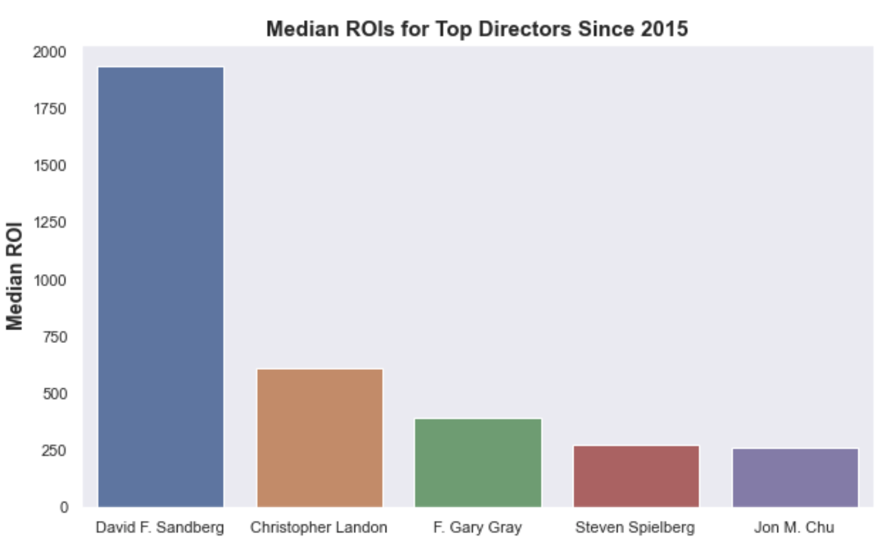
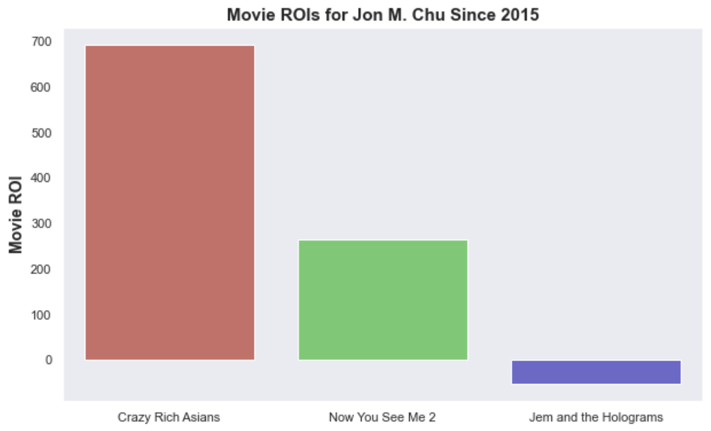
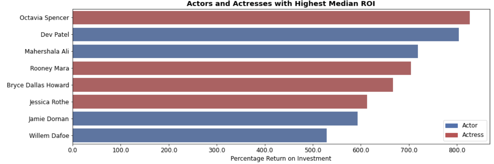

# Movie Analysis Project by Brooke Smyth, Garrett Williams, and Scott Schumann

**Overview:** Microsoft has decided to create a new movie studio, and they have requested our help to determine what decisions they should make to be successful. Our job is to analyze relevant data to determine which films are doing well at the box office, and which factors related to these successful films Microsoft can focus on in order to establish their new movie studio. 

**Business Problem:** Given that there are a number of factors that could be potentially related to the success of movies, we decided that we wanted to focus on individual people who have expertise in the industry that could help Microsoft with a successful start to their studio. Given the manner in which movies are made, we decided to focus in particular on three important categories of people who work in film:

1) Directors
2) Actors/Actresses
3) Writers

Our three actionable insights in the notebook that follows include lists of the top directors, actors/actresses, and writers sorted by highest median return on investment (ROI). We focused on ROI so that Microsoft could have a better chance at making a profit with their new studio, and we focused on median ROI as our measure of central tendency given that this would elimate significant outliers.

**Data Understanding:** For this project, we decided to use data collected from IMDB and The Numbers (TN). We were specifically interested in data relating to individual people (directors, actors/actresses, writers) which we found on IMDB, as well as data relating to the financial success of each film (ROI) which we found on TN. We thus decided to use data from these two sources, and merged the data frames to isolate the variables described below.

**Data Preparation:** Our main process was to analyze the data of people who work in these roles, honing in specifically on the ROI of projects they have worked on since 2015. We decided that ROI would be the most important measure for a new studio, given that they would want to ensure that they make a profit on their projects as they get started in the industry. We further isolated our data set to include only films made since 2015, given that we wanted to find people who have had recent success in the industry. The other factor that we included in each category below was to isolate individuals who have worked on more than two projects since 2015, given that we wanted to focus on people who are both currently active in the field as well as successful in their respective fields.

# Data Modeling
## Getting Top Directors by Highest Median ROI
The first category in our data set that we want to analyze are the top directors by highest median ROI.

## Getting Top Actors/Actresses by Highest Median ROI
Next on our list after analyzing top directors is to analyze the top actors/actresses by highest median ROI.

## Getting Top Writers by Highest Median ROI
Now that we have explored the top directors and actors by highest median ROI, the final recommendation that we want to make for Microsoft movie studios is for the top writers by highest median ROI.

# Conclusions
Based on the above data, here are our recommendations for Microsoft as they begin to work on their new movie studio. We have narrowed down our selections to the top two names in each category, but if the studio executives would like longer lists they can consult the information above.

<u>**RECOMMENDATION #1**:</u> Select one of these <u>directors</u> with the highest median ROI:
1) David F. Sandberg
2) Christopher Landon

<u>**RECOMMENDATION #2**:</u> Select someone from the list of <u>actors/actresses</u> with the highest median ROI:
1) Dev Patel
2) Mahershala Ali
1) Octavia Spencer
2) Rooney Mara

<u>**RECOMMENDATION #3**:</u> Select someone from the list of <u>writers</u> with the highest median ROI:
1) Jordan Peele
2) Brian Lynch

# Next Steps
Now that we have presented our findings, we can discuss some potential next steps for our project. 

1) Given that we have examined data pertaining to directors, actors/actresses, and writers as their own category, we would next like to analyze the correlations between the people in these categories. For example, which directors have the highest median ROI when working with certain actors/actresses or writers?

2) This is discussed in more detail in the appendix below, but another possible next step would be to look at the definitions of each genre label, as well as the relationships between movies with multiple genre labels (e.g. romantic comedies).

3) Finally, we might try to eliminate sequels from our data set, as successful movie franchises could potentially skew the data in favor of individuals who worked on multiple films.

# For More Information
See the full analysis in the [Jupyter Notebook](https://github.com/Shoemaker703/Movie_Analysis_Project/blob/main/Earth_Movie_Analysis_Project.ipynb) or review this presentation [presentation](https://docs.google.com/presentation/d/1AM7aVhYayuelQkxb7moxlukdQMellhBmODQ_TJS7NkM/edit#slide=id.p).

For additional info, contact Brooke Smyth at brookejsmyth@gmail.com, Garrett Williams at garrettwilliams90@gmail.com, or Scott Schumann at Scott.Schumann1@gmail.com